# Setting up K3s HA Cluster with Tailscale

## Prerequisites

- Conoha VPS (Cloud)
- Raspberry Pi (Home)
- Tailscale

## Architecture

```mermaid
graph TD
  %% --- Default Node Styling ---
  classDef podNode fill:#f3e5f5,stroke:#7b1fa2,stroke-width:2px,color:#000
  classDef epsNode fill:#fff8e1,stroke:#ff8f00,stroke-width:2px,color:#000

  %% --- 1. Cloud Infrastructure ---
  subgraph Public ["🌍 Internet"]
    CF_DNS("Cloudflare DNS")
  end

  subgraph Cloud ["☁️ Cloud (ConoHa VPS)"]
    direction TB
    C_Ext["Public IP: 157.x.x.x"]
    Controller["Ingress Nginx (Controller)"]
    Flannel["Flannel Interface"]

    CF_DNS -. "Domain Resolution" .-> C_Ext
    C_Ext -.-> Controller
    Controller --> Flannel
  end

  %% --- 2. VPN Tunnel ---
  subgraph VPN ["🌐 Tailscale Cloud"]
    Tunnel("Mesh VPN Tunnel")
  end

  %% --- 3. Home Infrastructure ---
  subgraph Home ["🏠 Home Network (On-Premises)"]
    direction TB

    subgraph Pi ["Raspberry Pi (Worker)"]
      R_Route["IPTables (Gatekeeper)"]
      R_Pod("Worker Pod")
      R_Route --> R_Pod
    end

    subgraph GPU ["GPU Host (Worker)"]
      G_Route["IPTables (Gatekeeper)"]
      G_AIPod("AI Pod<br>(GTX 1650 4GB)")
      G_Worker("Worker Pod")

      G_Route --> G_AIPod
      G_Route --> G_Worker
    end
  end

  %% --- Traffic Flow ---
  Flannel -- "Tailscale IP: 100.76.x.x" --> Tunnel
  Tunnel -- "Tailscale IP: 100.x.x.x" --> R_Route
  Tunnel -- "Tailscale IP: 100.x.x.x" --> G_Route

  %% --- Node Classes & Subgroup Coloring ---
  class Tunnel,CF_DNS epsNode;
  class R_Pod,G_AIPod,G_Worker podNode;

  %% --- Global Link Styling (For Dark Mode Visibility) ---
  linkStyle default stroke:#9e9e9e,stroke-width:2px,color:#9e9e9e

  style Public fill:#ffffff,stroke:#333,stroke-width:2px,color:#000,stroke-dasharray: 5 5
  style Cloud fill:#e3f2fd,stroke:#1565c0,stroke-width:2px,color:#000,stroke-dasharray: 5 5
  style VPN fill:#fff8e1,stroke:#ff8f00,stroke-width:2px,color:#000
  style Home fill:#e8f5e9,stroke:#2e7d32,stroke-width:2px,color:#000,stroke-dasharray: 5 5
  style Pi fill:#c8e6c9,stroke:#388e3c,stroke-width:2px,color:#000
  style GPU fill:#c8e6c9,stroke:#388e3c,stroke-width:2px,color:#000
```



## Installation

### Update System

```bash
sudo apt-get update
sudo apt-get upgrade -y
```

### Install Tailscale on Controller and Worker

```bash
curl -fsSL https://tailscale.com/install.sh | sh
sudo tailscale up

# Login your Tailscale Account with your Browser
```

### Uninstall Tailscale

```bash
sudo tailscale down
sudo apt-get purge tailscale -y
```

### Install K3s Controller with Github shell

```bash
curl -sSL https://raw.githubusercontent.com/Takayio/k3s-guideline/main/shell/install-master.sh | sh
```

### Uninstall K3s Controller

```bash
sudo /usr/local/bin/k3s-uninstall.sh
```

### Install K3s Worker with Github shell

```bash
sudo su
export MASTER_TAILSCALE_IP=""
export MASTER_TOKEN=""
curl -sSL https://raw.githubusercontent.com/Takayio/k3s-guideline/main/shell/install-worker.sh | sh
```

### Uninstall K3s Worker

```bash
sudo /usr/local/bin/k3s-agent-uninstall.sh
```
